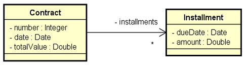
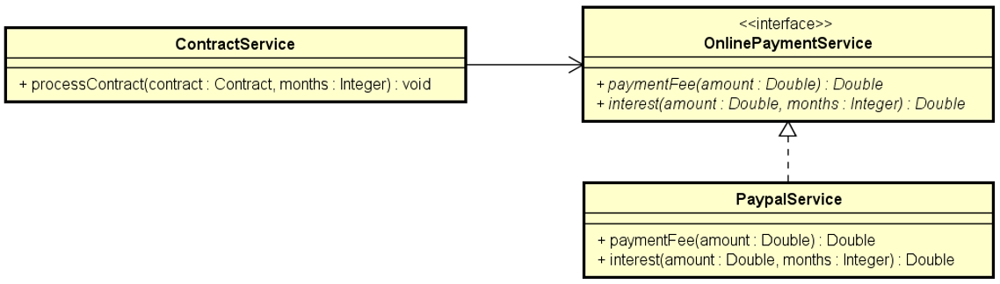

# Projeto de Exercício de Aprendizado em Java

Este projeto é um exercício de aprendizado em Java, desenvolvido para praticar e aplicar conceitos estudados relacionados à linguagem de programação. O enunciado do projeto é o seguinte:

## Enunciado do Exercício

Uma empresa deseja automatizar o processamento de seus contratos. O processamento de um contrato consiste em gerar as parcelas a serem pagas para aquele contrato, com base no número de meses desejado.

A empresa utiliza um serviço de pagamento online para realizar o pagamento das parcelas. Os serviços de pagamento online tipicamente cobram um juro mensal, bem como uma taxa por pagamento. Por enquanto, o serviço contratado pela empresa é o do Paypal, que aplica juros simples de 1% a cada parcela, mais uma taxa de pagamento de 2%.

Fazer um programa para ler os dados de um contrato (número do contrato, data do contrato, e valor total do contrato). Em seguida, o programa deve ler o número de meses para parcelamento do contrato, e daí gerar os registros de parcelas a serem pagas (data e valor), sendo a primeira parcela a ser paga um mês após a data do contrato, a segunda parcela dois meses após o contrato e assim por diante. Mostrar os dados das parcelas na tela.

## Conceitos Aplicados

Este projeto aplica os seguintes conceitos de Java:

- **Orientação a Objetos**: Utilização de classes, objetos, encapsulamento, e métodos para modelar e manipular os contratos e parcelas.
- **Tratamento de Data e Hora**: Utilização da classe `Date` e `Calendar` para lidar com datas e cálculos de parcelas.
- **Entrada e Saída de Dados**: Utilização da classe `Scanner` para receber entrada de dados do usuário e `System.out.println` para exibir informações na tela.
- **Interfaces**: Implementação da interface `OnlinePaymentService` para modelar os serviços de pagamento online.
- **Polimorfismo**: Utilização da implementação da interface `OnlinePaymentService` pela classe `PaypalService`.
- **Listas e Coleções**: Utilização de `List` para armazenar as parcelas de um contrato.
- **Manipulação de Strings**: Utilização de formatação de strings para apresentar informações na tela.

## Funcionamento do Código

O código consiste em três pacotes principais:

- **model.entities**: Contém as classes `Contract` e `Installment`, responsáveis por modelar os contratos e as parcelas.
- **model.services**: Contém a interface `OnlinePaymentService`, a classe `PaypalService` que implementa essa interface, e a classe `ContractService` responsável por processar os contratos e gerar as parcelas.
- **App**: Classe principal que contém o método `main`, onde ocorre a interação com o usuário para entrada dos dados do contrato, processamento do contrato e exibição das parcelas.

## Diagramas
### Entidades


### Services


### Cálculos
```
Parcela #1: 
200 + 1% * 1 = 202 
202 + 2% = 206.04
```
```
Parcela #2: 
200 + 1% * 2 = 204 
204 + 2% = 208.08
```
```
Parcela #3: 
200 + 1% * 3 = 206 
206 + 2% = 210.12
```

## Executando o Código

Para executar o código, basta compilar todas as classes e executar a classe `App`. Após a execução, o programa solicitará os dados do contrato e o número de parcelas desejadas, e então mostrará as informações das parcelas geradas na tela.

## Exemplo do código rondando
```
Enter contract data
Number: 0001
Date (dd/MM/yyyy): 08/03/2024
Contract value: 600.00
Enter number of installment: 3
Installments: 
08/04/2024 - 206.04
08/05/2024 - 208.08
08/06/2024 - 210.12
```

